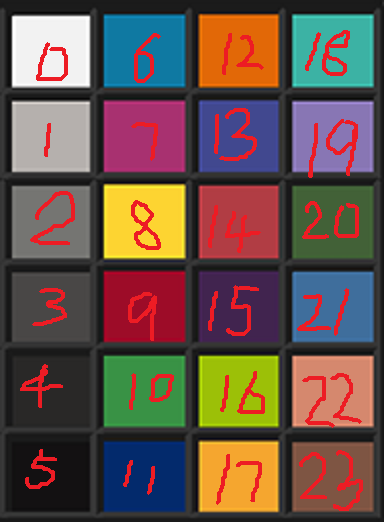

# SpyderCHECKR24
Library of Color Correction Matrix for color checker24 ( SpyderCHECKR24 )

## Usage
``` c++
bool CCMSolve(const std::vector<int> &real_colors, double *ccm, double gamma = 2.2)
```

```real_colors``` is real color list of each patch in the color card.



